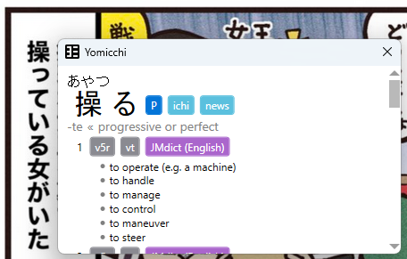

# Yomicchi
## Overview
Yomicchi is a Windows text scanning tool that enables users to view Japanese word definitions in real time. It is heavily inspired by [Yomichan](https://foosoft.net/projects/yomichan/), a browser extension by FooSoft Productions.

## Prerequisites
* .NET 8.0
* Azure Computer Vision 
  * API Endpoint
  * Key 

## Running the Project
1. Clone this project locally
2. Restore dependencies
```powershell
dotnet restore
```

3. Set your Azure Computer Vision credentials in `src/Yomicchi.Desktop/appsettings.json`
```json
{
  "AzureOptions": {
    "Endpoint": "sample.cognitiveservices.azure.com",
    "Key": "<computer-vision-key>"
  }
}
```

4. Run the WPF application
```powershell
dotnet run --project src/Yomicchi.Desktop
```

The window should look something like this.


Yomicchi uses [the same dictionaries as Yomichan](https://foosoft.net/projects/yomichan/index.html#dictionaries). To load the dictionaries, you can drag the .zip files in the Yomicchi window. 

The dictionary should appear as below when it is successfully loaded. 


## Usage
Press and Hold the `Ctrl` key to switch to Snipping mode. You should see your entire screen dim a little bit. While in Snipping mode, drag your mouse over the Japanese text. You should see a blue bounding box appear, indicating the selected area.


Once you release your mouse, the Search Results window should appear beside the detected word.



The tool supports both horizontally-written and vertically-written Japanese. Inflections are also properly considered when showing the definitions.